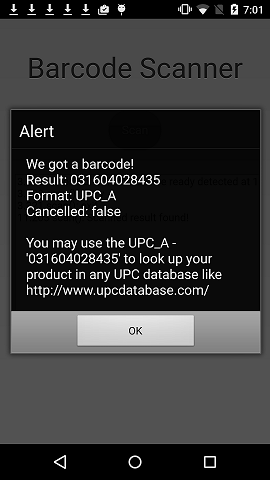

Barcode Scanner Tutorial
========================

The source code for this sample [can be found on GitHub][1] or as part of the
[Intel® XDK][2].

[1]: https://github.com/gomobile/sample-barcode-scanner
[2]: https://software.intel.com/en-us/html5/tools

Introduction
------------

By leveraging [Apache Cordova* plugins][3], you can develop hybrid mobile
HTML5 apps for many platforms and use cases. Apache Cordova is a framework for
adding device-specific APIs to hybrid mobile HTML5 apps. Using Cordova,
developers can access device-specific hardware and software, such as the
camera or contacts database, that you would normally not have access to from
an HTML5 app running within the mobile browser. Besides the core Cordova APIs,
many third-party Cordova plugins are available in the
[Apache Cordova Plugin Registry][3] and on GitHub that extend the JavaScript
APIs available for use with your app.

[3]: https://cordova.apache.org/plugins/#/

Purpose
-------

This simple app scans a barcode using the [Phonegap* Barcode Scanner plugin][4].
The result could then be used for product lookup in a UPC database, for example.
This plugin supports a wide range of barcode types, such as QR_CODE,
DATA_MATRIX and AZTEC.

[4]: https://github.com/phonegap/phonegap-plugin-barcodescanner

This sample app uses the following API, which is provided by the barcode
scanner Cordova plugin:

* `cordova.plugins.barcodeScanner.scan()` activates the device camera to scan
  for a barcode and, upon a successful scan, returns an object containing:

  * data (text representation of the barcode data)
  * type (type of barcode detected)
  * canceled (whether or not the user canceled the scan)

~~~~~~~~~~~~JavaScript
    cordova.plugins.barcodeScanner.scan(
        function (result) {
            console.log(fName, "Scanned result found!");
            alert("We got a barcode!\n" +
                "Result: " + result.text + "\n" +
                "Format: " + result.format + "\n" +
                "Cancelled: " + result.cancelled + "\n\n" +
                "You may use the " + result.format + " - '" + result.text + "' to look up your product in any UPC database like http://www.upcdatabase.com/");
        },
        function (error) {
            alert("Scanning failed: " + error);
        }
    );
~~~~~~~~~~~~

Each UI button is bound to methods that encapsulate the functionality of
the plugin or API. Those methods are defined in `app.js`.

  

Testing
-------

**Simulator:** Does not support third party plugins. So this app must be built
and tested on device.

**App Preview:** Does not support third party plugins. So this app must be built
and tested on device.

**Built app:** This sample application has been tested on iOS and Android devices.
